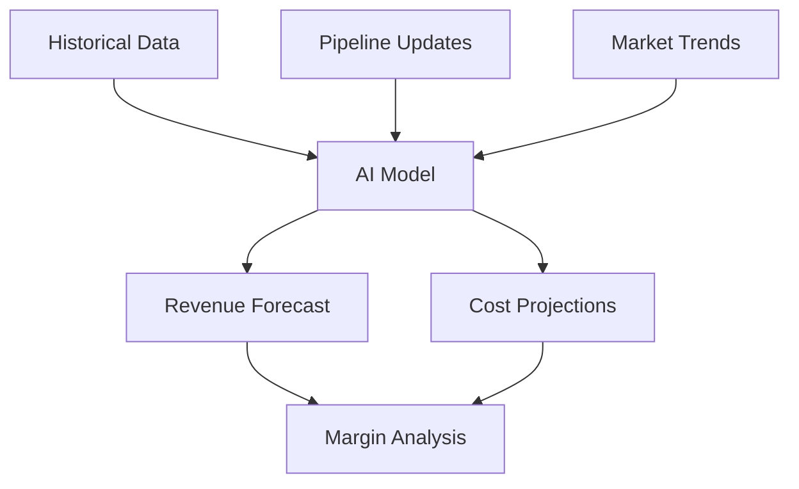

## Overview

Successpro empowers technology services companies with an integrated platform for projects, people, and financials. You gain visibility into operations, boost efficiency, and drive profitable growth. Key features address common pain points like siloed data, underutilized teams, inaccurate forecasting, and missed insights.

<Callout kind="info" collapsed="false">
  Operate smart. Deliver more. Grow profitably with Successpro's unified AI platform.
</Callout>

## Core Features

Explore the main capabilities through these feature cards.

<Columns cols="2">
  <Card title="Project Management Tools" href="#project-management" icon="calendar" horizontal="false">
    Plan, track, and deliver projects with real-time dashboards and automated workflows.
  </Card>

  <Card title="People Utilization Tracking" href="#utilization" icon="users" horizontal="false">
    Monitor team capacity, skills, and allocation to maximize resource efficiency.
  </Card>

  <Card title="Financial Forecasting" href="#forecasting" icon="trending-up" horizontal="false">
    Predict revenue, costs, and margins with AI-powered models and scenario planning.
  </Card>

  <Card title="AI-Driven Insights" href="#insights" icon="zap" horizontal="false">
    Get actionable recommendations from data analysis to optimize performance.
  </Card>
</Columns>

## Project Management Tools

Manage your entire project lifecycle in one place. Create tasks, assign resources, set milestones, and monitor progress with Gantt charts and Kanban boards.

<Tabs>
  <Tab title="Setup" icon="settings">
    <Steps>
      <Step title="Create Project" icon="plus" title-type="p">
        Navigate to the dashboard and click "New Project". Enter details like name, timeline, and budget.
      </Step>

      <Step title="Add Tasks" icon="list" title-type="p">
        Break down work into tasks. Assign owners and deadlines.
      </Step>

      <Step title="Track Progress" icon="eye" title-type="p">
        Use the overview board to visualize status at a glance.
      </Step>
    </Steps>
  </Tab>

  <Tab title="API Integration" icon="code">
    <CodeGroup show-lines="true">
      ```javascript
      const response = await fetch('https://api.example.com/projects', {
        method: 'POST',
        headers: { 'Authorization': 'Bearer YOUR_TOKEN', 'Content-Type': 'application/json' },
        body: JSON.stringify({
          name: 'New Client Project',
          startDate: '2024-01-01',
          budget: 50000
        })
      });
      ```

      ```python
      import requests
      response = requests.post(
          'https://api.example.com/projects',
          headers={'Authorization': 'Bearer YOUR_TOKEN', 'Content-Type': 'application/json'},
          json={'name': 'New Client Project', 'startDate': '2024-01-01', 'budget': 50000}
      )
      ```
    </CodeGroup>
  </Tab>
</Tabs>

## People Utilization Tracking

Track how your team spends time across projects. Identify bottlenecks, overworked staff, and idle resources to improve allocation.

| Metric            | Description                  | Target     |
| ----------------- | ---------------------------- | ---------- |
| Utilization Rate  | Percentage of billable hours | `>85%`     |
| Skill Coverage    | Gaps in team expertise       | Minimize   |
| Capacity Forecast | Upcoming availability        | Plan ahead |

<Expandable title="Advanced Reporting" default-open="false">
  Export utilization data to CSV or integrate with payroll systems for automated invoicing.
</Expandable>

## Financial Forecasting

Build accurate forecasts using historical data, pipeline updates, and market trends. Run what-if scenarios to test profitability impacts.



<Callout kind="tip" collapsed="false">
  Update your pipeline weekly to refine forecasts and avoid surprises.
</Callout>

## AI-Driven Insights

Leverage machine learning for proactive recommendations. Spot risks early, suggest optimal staffing, and highlight growth opportunities.

<Board uid="743b76d7-bc33-466a-b87f-812bcc24a77c" title="Insight Pipeline">
  <BoardColumn title="Monitoring" uid="40a58524-e9c8-42a1-8e8f-0d358bd51a45" color="0" icon="eye">
    <BoardCard title="Utilization Trends" uid="2d761fc8-61b4-4ff6-a1ed-ac4e3428fd0b" description="Weekly team efficiency report" />
  </BoardColumn>

  <BoardColumn title="Active" uid="7393fbeb-ec9c-4454-a9d1-2319be1a27ab" color="1" icon="loader">
    <BoardCard title="Profitability Alerts" uid="cbbf04fa-512b-4abd-98d5-9100f4fdfe15" description="Projects under target margins" due-date="2024-12-31" />
  </BoardColumn>

  <BoardColumn title="Actioned" uid="61a1a61e-35a2-4bd9-9c24-a2c8c04f9709" color="2" icon="check-circle">
    <BoardCard title="Resource Reallocation" uid="8791ac55-553b-48e8-a1fe-e78713f9dad9" description="Moved staff to high-priority project" created-at="2024-12-15" />
  </BoardColumn>
</Board>

## Next Steps

<Columns cols="2">
  <Card title="Get Started" href="/quickstart" icon="rocket" horizontal="false">
    Follow the quickstart guide to set up your first project.
  </Card>

  <Card title="API Reference" href="/authentication" icon="book-open" horizontal="false">
    Integrate Successpro into your workflows via API.
  </Card>
</Columns>

